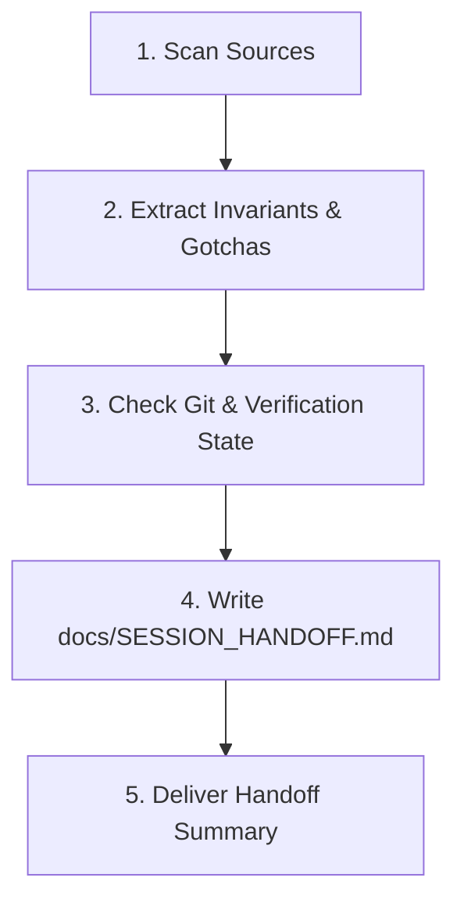

# Agentic Session Handoff & Knowledge Transfer

## 1. Overview & Purpose
Preserves project continuity and prevents AI hallucinations during long conversations or session transitions. 
Extracts architectural invariants, verified runtime facts, active state, and next steps into a structured persistent checkpoint.

### When to Activate:
- User triggers `/v-session-handoff` (or `/v-agent-handoff`).
- Context window compaction is approaching or session length is growing large.
- User explicitly requests: *"передай контекст наступному агенту"*, *"збережи наш прогрес"*, *"підсумуй знання сесії"*.
- Before switching tasks, branching major refactors, or ending an active development shift.

---

## 2. Handoff Synthesis Protocol (Step-by-Step)



### Step 1: Scan Historical Sources
Inspect:
1. **Conversation History & Logs:** the current conversation context, plus earlier sessions in `~/.claude/projects/<encoded-project-path>/*.jsonl`.
2. **Current Artifacts:** plan files, any roadmap or planning docs the project keeps, and any open PR or task lists.
3. **Repository State:** `git status -s`, `git branch --show-current`, `git log -n 3 --oneline`.

### Step 2: Extract High-Signal Core Knowledge
Distill only immutable facts and non-obvious engineering decisions:
- **Product & System Intent:** What are we building, why, and under what business constraints?
- **Strict Package Invariants:** zero dependencies, the barrel as the only public API, deterministic painting, palette-only colours.
- **Solved Gotchas & Traps:** Hardware/OS-specific traps (e.g. macOS App Sandbox permissions, GUI app `PATH` resolution, CLI flags like `-y / --yolo`).
- **Validated Facts:** Features proven to work via automated tests (`flutter test`) or runtime inspection (the Dart MCP server against the running example).

### Step 3: Write Persistent Checkpoint (`docs/SESSION_HANDOFF.md`)
Always create or overwrite `docs/SESSION_HANDOFF.md` using this standard schema:

```markdown
# Agentic OS — Session Handoff Checkpoint

**Date & Time:** <ISO-8601 or Local Timestamp>  
**Branch:** <current git branch> | **Last Commit:** <short-hash> - <commit message>

## 1. Strategic Goals & Active Phase
- High-level goal and roadmap stage (e.g., Phase 1 MVP completed; ready for Phase 2).

## 2. Architectural Boundaries & Rules
- Key non-negotiables from CLAUDE.md (e.g., zero dependencies, deterministic painting, no push or publish without instruction, communication language).

## 3. Solved Traps & Technical Decisions
- Bulleted list of proven solutions to hard bugs (avoiding reinventing the wheel).

## 4. Current State of Repository & Verification
- Test status (`flutter test` results, `dart analyze` status).
- Files modified or staged.

## 5. Immediate Next Actions (Phase Backlog)
1. Next concrete task with exact file targets.
2. Open design decisions or dependencies.
```

### Step 4: Deliver Successor Agent Prompt & User Confirmation
- Output a clear, highly concentrated response in the user's preferred language (Ukrainian).
- Include a 1-click prompt snippet that the user or next agent can paste to resume work instantly without reading thousands of past chat lines.
