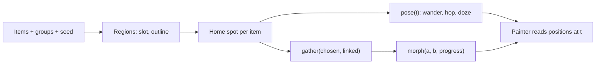

# Procedural World Layout

## 1. Overview & When to Apply

Use this skill whenever:
- Many items (tens to thousands) are placed on a drawn world — a map, a meadow, a planet — grouped
  into regions, instead of in a list or a grid.
- The same data must always produce the same picture, and adding one item must not reshuffle the rest.
- Items look alive (walk, hop, doze) or regroup on demand (gather around a chosen one) and
  a transition morphs one arrangement into another.

Drawing the placed items is not covered here: one item in
[flutter-procedural-character](../flutter-procedural-character/SKILL.md), a crowd in
[flutter-canvas-batch-rendering](../flutter-canvas-batch-rendering/SKILL.md).

---

## 2. Prerequisites & Related Skills

| Relation | Skill | When to Consult |
| :--- | :--- | :--- |
| **Parent Hub** | [flutter-ui-hub](../flutter-ui-hub/SKILL.md) | Presentation laws and routing |
| **Drawing a crowd** | [flutter-canvas-batch-rendering](../flutter-canvas-batch-rendering/SKILL.md) | Atlas, levels of detail, hit grid over the positions made here |
| **Drawing one item** | [flutter-procedural-character](../flutter-procedural-character/SKILL.md) | Poses the motion here drives |
| **Heavy passes** | [performance-hub](../performance-hub/SKILL.md) | Isolates, measuring in profile mode |

---

## 3. Technical Constraints

1. **Layout is a pure function.** `layout(items, groups, seed, size) → positions`: no clock, no
   `Random()` without a seed, no widget state. Same inputs, same numbers — so it is unit-tested
   without Flutter and goldens stay stable.
2. **Motion is a closed form, not a stepped simulation.** `pose(home, id, t)` computes where an item
   is at time `t` from its id's phases. Nothing integrates frame by frame, so any time can be
   rendered, a golden picks one, reduced motion reads `t = 0`, and a hidden screen costs nothing.
3. **Everything random comes from a stable hash of the id** (never `String.hashCode`, which is not
   stable across runs, and never the index in a list). An item's spot, phase and gait depend on its
   own id and its region only.
4. **Regions never overlap by construction.** Each region owns a slot (a cell, a sector, a cap);
   its outline is scaled until it fits the slot with a gap. Overlap is prevented, not detected.
5. **Stability.** Adding an item moves at most its own region's items; adding a region moves no
   existing region. Slots are keyed by a stable group key, never by the order groups arrive in.
6. **Pure Dart.** Layout code imports `dart:math` and `dart:typed_data` only — no Flutter types —
   so it runs in `Isolate.run` when a pass is heavy (sphere lattices, thousands of items).
7. **Results are flat buffers.** `Float32List` of x, y per item in a fixed item order; painters read
   them without allocating (see batch rendering).

---

## 4. Job Router

| Task | Reference |
| :--- | :--- |
| Region slots, organic outlines fitted to a slot, placement inside a polygon, points on a sphere and caps as continents, stability rules | [regions_and_placement_guide.md](references/regions_and_placement_guide.md) |
| Wandering, hopping and dozing in closed form, gathering a set around a chosen item, morphing between layouts, isolates, tests | [motion_and_morphing_guide.md](references/motion_and_morphing_guide.md) |

---

## 5. Workflow

1. Fix the slot of every group from a stable key (cell of a grid, cap on a sphere).
2. Build each region's outline from its seed; fit it into its slot.
3. Place every item's home inside its outline from the item's own seed; relax spacing within a region.
4. Add motion as `pose(home, id, t)`; add gathering and morphs as pure functions too.
5. Test determinism, non-overlap, containment and stability; profile the painter in profile mode.

---

## 6. Anti-Patterns

| Anti-Pattern | Severity | Corrective Action |
| :--- | :--- | :--- |
| Force simulation stepped every frame for a scene that only needs to look alive | **HIGH** | Fixed homes + closed-form motion |
| `Random()` unseeded, `String.hashCode` or list index as a seed | **CRITICAL** | Stable hash of the id |
| Region positions from the order groups arrive in | **HIGH** | Slots keyed by a stable group key |
| Checking overlaps after placing regions and nudging them apart | **MEDIUM** | Fit each outline into its own slot |
| Layout code importing `package:flutter` (`Offset`, `Rect`) | **MEDIUM** | Plain doubles and typed lists; convert in the painter |
| A new `List<Offset>` per frame | **MEDIUM** | Reused `Float32List` buffers |

---

## 7. Verification Checklist

- [ ] Same items, groups and seed produce identical buffers (unit test).
- [ ] No two region outlines intersect; every item's home lies inside its region.
- [ ] Adding an item to one region leaves every other region's positions bit-identical.
- [ ] Motion reads no clock; `t = 0` is the rest pose used under reduced motion.
- [ ] Heavy passes measured; moved to `Isolate.run` only when they cost a frame.
