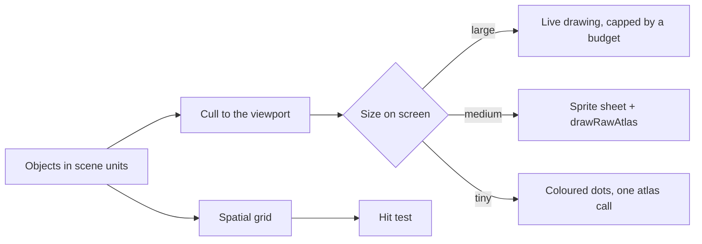

# Batch Rendering on a Canvas

## 1. Overview & When to Apply

Use this skill whenever:
- One `CustomPainter` draws hundreds or thousands of similar objects (a flock, map pins, graph nodes).
- A scene zooms, so the same object is sometimes big and detailed, sometimes a few pixels.
- The pointer must find the object under it without widget hit-testing.
- Frame time grows with the number of objects and profile mode says the raster thread is the cost.

---

## 2. Prerequisites & Related Skills

| Relation | Skill | When to Consult |
| :--- | :--- | :--- |
| **Parent Hub** | [performance-hub](../performance-hub/SKILL.md) | Profiling and frame budgets |
| **Drawing one object** | [flutter-procedural-character](../flutter-procedural-character/SKILL.md) | The live drawing the sprites are made from |
| **GPU cost** | [performance-expensive-operations](../performance-expensive-operations/SKILL.md) | `saveLayer`, clipping, blur |
| **Foundation** | [flutter-ui-advanced-graphics](../flutter-ui-advanced-graphics/SKILL.md) | `CustomPainter` basics |
| **Placing the crowd** | [dart-procedural-world-layout](../dart-procedural-world-layout/SKILL.md) | Positions, regions and motion the painter reads |

---

## 3. Technical Constraints

1. **Measure first, in profile mode.** Know the cost of one live object before choosing levels:
   raster time ÷ count gives the live budget for a 16.7 ms frame.
2. **Levels of detail by size on screen**, not by count: live above a pixel size, sprite below it,
   a dot below that. A budget caps live objects; the smallest live ones fall back to sprites.
3. **One call per level.** Sprites come from one sheet image drawn by one `drawRawAtlas`; dots are
   one more `drawRawAtlas` of a white disc with per-dot colours (`BlendMode.modulate`).
4. **Sprites are built once per key, not per object.** `Picture.toImageSync` makes a sprite
   synchronously; the sheet is rebuilt only when a new key appears. Objects that differ only
   slightly (a tint shift) share their key's sprite.
5. **Reuse the buffers.** `Float32List` transforms and rects, an `Int32List` of colours, grown only
   when the count grows; nothing allocated per frame for the unchanged scene.
6. **Cull before anything else**: skip objects whose bounds miss the viewport.
7. **Hit-test through a spatial grid** in scene units: cells of about one object's size, the
   last-drawn object wins, rebuilt only when positions change.
8. **Dispose images** (`ui.Image.dispose`) when the cache is dropped.

---

## 4. Job Router

| Task | Reference |
| :--- | :--- |
| Sprite sheet from pictures, `drawRawAtlas` for sprites and dots, buffers, levels and budget | [atlas_and_lod_guide.md](references/atlas_and_lod_guide.md) |
| Spatial grid for hit tests, culling, measuring in profile mode | [grid_and_measuring_guide.md](references/grid_and_measuring_guide.md) |

---

## 5. Anti-Patterns

| Anti-Pattern | Severity | Corrective Action |
| :--- | :--- | :--- |
| One widget or `CustomPaint` per object in a big scene | **HIGH** | One painter for the scene |
| `drawImage` per sprite, `drawCircle` per dot | **HIGH** | One `drawRawAtlas` per level |
| A sprite per object when objects differ by a tint | **HIGH** | One sprite per key, shared |
| New `Float32List`s every frame | **MEDIUM** | Keep and grow the buffers |
| Hit-testing by looping over every object | **MEDIUM** | A spatial grid |
| Numbers from debug mode | **HIGH** | Profile mode only |

---

## 6. Verification Checklist

- [ ] Live cost per object measured in profile mode; the budget follows from it.
- [ ] Levels chosen by size on screen, with a cap on live objects.
- [ ] One atlas call per level; one sheet image, rebuilt only for new keys.
- [ ] Buffers reused; nothing allocated per frame for an unchanged scene.
- [ ] Culling before level selection; hit tests through a grid.
- [ ] Images disposed with their cache.
