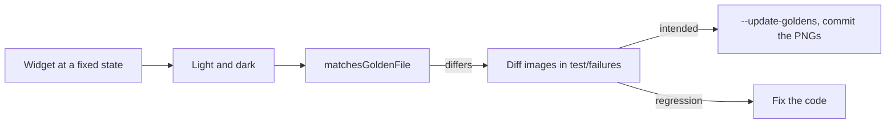

# Golden Tests

## 1. Overview & When to Apply

Use this skill whenever:
- A `CustomPainter` or a UI Kit component must keep its look, and a pixel change should be seen in
  review rather than discovered later.
- A golden fails and it has to be decided: regression, or an intended change to accept.

---

## 2. Prerequisites & Related Skills

| Relation | Skill | When to Consult |
| :--- | :--- | :--- |
| **Parent Hub** | [testing-hub](../testing-hub/SKILL.md) | Test layers and conventions |
| **Widget tests** | [testing-widget](../testing-widget/SKILL.md) | Pumping and finding widgets |
| **Animated painters** | [flutter-procedural-character](../flutter-procedural-character/SKILL.md) | Painting at a fixed time |

---

## 3. Technical Constraints

1. **No package.** `matchesGoldenFile` from `flutter_test` is enough; do not add a golden library
   unless it was asked for (Law 1).
2. **One state per golden, fixed.** No clock, no randomness, no network: animated widgets are
   pumped without a ticker or at a given time; ids that seed randomness are constants.
3. **Both themes.** One golden per theme, or both side by side in one image.
4. **Own the surface.** Set `tester.view.physicalSize` and `devicePixelRatio`, wrap the subject in
   a `RepaintBoundary` with a key, and match that key, not the whole screen.
5. **Text renders as boxes** unless fonts are loaded; prefer goldens of painters and shapes, and
   load the real fonts (`FontLoader`) only where text is the point.
6. **Goldens live beside their test** in `test/goldens/<area>/`, named `<subject>_<variant>.png`,
   and are committed. They are made on the development Mac; a small tolerance absorbs anti-aliasing
   differences, never real changes.
7. **Tag them** `golden` so they can be run or updated alone.

---

## 4. Job Router

| Task | Reference |
| :--- | :--- |
| Writing a golden test, the tolerance comparator, running and updating, reading a failure | [golden_workflow_guide.md](references/golden_workflow_guide.md) |

---

## 5. Anti-Patterns

| Anti-Pattern | Severity | Corrective Action |
| :--- | :--- | :--- |
| A golden of something that animates, taken at "now" | **CRITICAL** | Fix the time or pump without a clock |
| Updating goldens to make a red build green | **HIGH** | Look at the diff first; update only intended changes |
| Whole-screen goldens for one component | **MEDIUM** | Match a keyed `RepaintBoundary` around the subject |
| A tolerance large enough to hide a shape change | **HIGH** | Keep it at a few pixels (0.01 %); prove it with a deliberate small change that must fail |

---

## 6. Verification Checklist

- [ ] The subject is at a fixed state; nothing depends on time or randomness.
- [ ] Light and dark are both covered.
- [ ] The surface size and pixel ratio are set; a keyed `RepaintBoundary` is matched.
- [ ] Goldens are in `test/goldens/<area>/`, committed, and tagged `golden`.
- [ ] A failing golden was reviewed from its diff images before any update.
- [ ] The tolerance was proven by a deliberate small change that failed.
