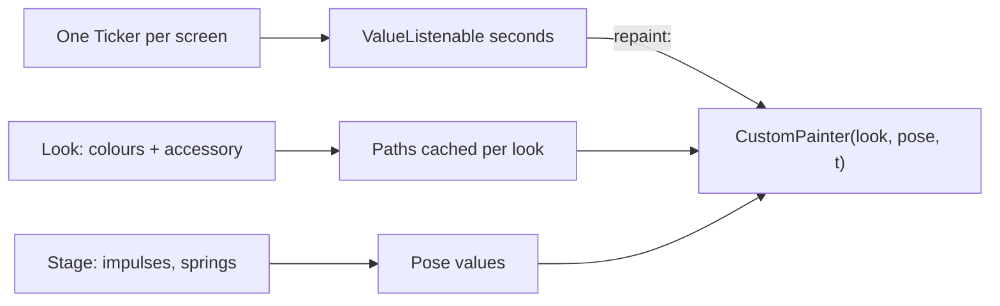

# Procedural Characters with CustomPainter

## 1. Overview & When to Apply

Use this skill whenever:
- A mascot, avatar or creature is drawn with `Canvas` and `Path` instead of an image or Rive file.
- A character needs looks (colour sets, accessories) or poses chosen at runtime.
- Several characters on one screen must breathe, blink and react without looking synchronised.
- A painter animates continuously and must stay cheap when it is hidden or off screen.

For hundreds of characters in one canvas (sprites, levels of detail, hit-testing) continue with
[flutter-canvas-batch-rendering](../flutter-canvas-batch-rendering/SKILL.md); this one covers a
single character and small groups.

---

## 2. Prerequisites & Related Skills

| Relation | Skill | When to Consult |
| :--- | :--- | :--- |
| **Parent Hub** | [flutter-ui-hub](../flutter-ui-hub/SKILL.md) | Presentation laws and routing |
| **Foundation** | [flutter-ui-advanced-graphics](../flutter-ui-advanced-graphics/SKILL.md) | `RepaintBoundary`, `shouldRepaint`, springs |
| **Colours** | [flutter-ui-theme-extensions](../flutter-ui-theme-extensions/SKILL.md) | The character's palette as a `ThemeExtension` |
| **Profiling** | [performance-hub](../performance-hub/SKILL.md) | Measuring frame cost in profile mode |
| **Goldens** | [flutter-golden-tests](../flutter-golden-tests/SKILL.md) | Pinning each look at a fixed time, both palettes |

---

## 3. Technical Constraints

1. **One unit.** Every coordinate is a multiple of one unit (the body diameter). Size is a canvas
   scale, never a second set of numbers.
2. **Geometry is data, time is an argument.** A painter receives a look, a pose and the time in
   seconds; it never reads a clock, `Random()` or `DateTime.now()`. Same inputs, same pixels, so
   goldens and previews are stable.
3. **No allocation per frame.** Paths are built once per look and cached; `Paint` objects live on
   the painter and only their `color` changes. Motion is `canvas.save/translate/rotate/scale`,
   never rebuilding a `Path`.
4. **Repaint through a `Listenable`.** `CustomPainter(repaint: driver)` repaints without rebuilding
   any widget. `setState` per frame is forbidden.
5. **One driver per screen.** A single `Ticker` advances time for every character on the screen.
   Created from the widget's `vsync`, it stops by itself under `TickerMode(enabled: false)`
   (hidden tabs, routes below the top), so a hidden screen costs no frames.
6. **Colours from the theme.** The painter takes resolved `Color`s from a `ThemeExtension`; no
   `Color(0x…)` literal inside painting code (Law 3).
7. **Reduced motion.** When `MediaQuery.disableAnimationsOf(context)` is true, idle motion freezes
   in its rest pose; state changes still show, without the tween.
8. **Size limits.** Split painting per body part (`_paintBody`, `_paintEyes`, …) into small
   classes or files once a painter passes ~150 lines (Law 5 applies to painters too).

---

## 4. Job Router

| Task | Reference |
| :--- | :--- |
| Unit geometry, part paths, draw order, accessories anchored to parts, path caching per look | [character_geometry_guide.md](references/character_geometry_guide.md) |
| The shared driver, desynchronised idle, blink scheduler, pose springs, reactions, tests | [character_animation_guide.md](references/character_animation_guide.md) |

---

## 5. Workflow

1. Sketch the character on a grid of the unit; write each part's anchor and size as a fraction.
2. Model `Look` (colours, accessory) and `Pose` (a flat set of doubles) as immutable values with
   `lerp`; no domain type enters the kit.
3. Build the part paths for a look once; paint back to front.
4. Add the driver; derive each character's phase from its stable id.
5. Add poses and reactions as springs toward a target `Pose`.
6. Golden-test every look in both themes at fixed times; profile a crowd.

---

## 6. Anti-Patterns

| Anti-Pattern | Severity | Corrective Action |
| :--- | :--- | :--- |
| `AnimationController` per character, `setState` per frame | **CRITICAL** | One driver per screen, `repaint:` listenable |
| `Random()` or a clock read inside `paint()` | **CRITICAL** | Seed from the character's id; pass time in |
| Rebuilding `Path`s every frame | **HIGH** | Cache per look; move with canvas transforms |
| Every character blinks and breathes in step | **HIGH** | Per-id phase offsets and jittered schedules |
| Hard-coded colours in the painter | **HIGH** | Resolve from a `ThemeExtension` and pass in |
| A 400-line `paint()` | **MEDIUM** | One painter class per part, composed in order |

---

## 7. Verification Checklist

- [ ] All geometry in units; size is only a scale.
- [ ] `paint()` allocates nothing and reads no clock or random source.
- [ ] One ticker per screen; hidden screens stop ticking (`TickerMode`).
- [ ] Idle motion desynchronised per character and frozen under reduced motion.
- [ ] Every look golden-tested in light and dark at fixed times.
- [ ] Frame cost of the target crowd measured in profile mode, not debug.
