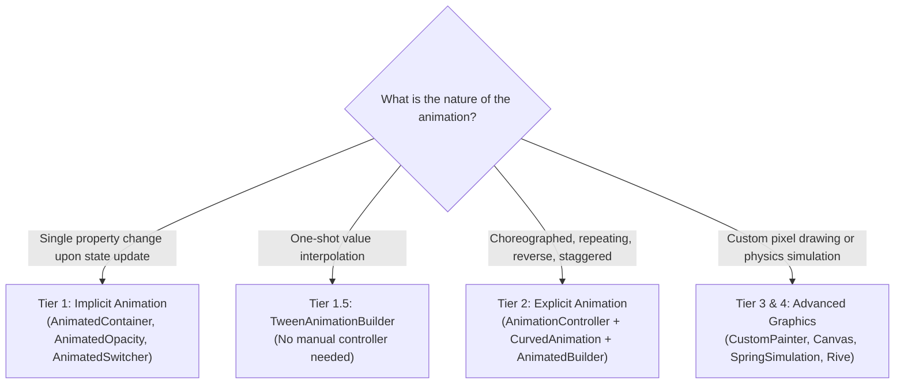

# Flutter Animations: Implicit & Explicit Motion Guide (Tiers 1 & 2)

## 1. Overview & When to Apply

Use this skill whenever:
- Adding smooth, delightful UI transitions and micro-interactions.
- Choosing the right animation mechanism based on the **Animation Complexity Ladder**.
- Implementing **Tier 1 (Implicit)** animations (`AnimatedContainer`, `AnimatedOpacity`, `AnimatedCrossFade`, `AnimatedSwitcher`, `AnimatedPositioned`).
- Implementing **Tier 2 (Explicit)** choreographed animations (`AnimationController`, `CurvedAnimation`, `TweenSequence`, Staggered animations).
- Optimizing frame rates to guarantee 60/120 FPS via static `child` parameter reuse and proper resource disposal.

---

## 2. Prerequisites & Related Skills

| Relation | Skill | Purpose |
| :--- | :--- | :--- |
| **Parent Hub** | [flutter-ui-hub](../flutter-ui-hub/SKILL.md) | Presentation laws and UI routing. |
| **Advanced Motion** | [flutter-ui-advanced-graphics](../flutter-ui-advanced-graphics/SKILL.md) | Tier 3 & 4 (CustomPainter, Shaders, Rive, Physics). |
| **Performance Rendering** | [performance-rendering-build](../performance-rendering-build/SKILL.md) | Child parameter caching and build optimization. |
| **Expensive Operations** | [performance-expensive-operations](../performance-expensive-operations/SKILL.md) | Opacity anti-patterns, saveLayer, and GPU offscreen buffers. |

---

## 3. The Animation Complexity Ladder

---

## 4. Job Router

| Task | Reference |
| :--- | :--- |
| Tier 1 implicit widgets (`AnimatedContainer`, `AnimatedCrossFade`) and Tier 2 controllers, staggered intervals, reusing the static `child` | [implicit_and_explicit_guide.md](references/implicit_and_explicit_guide.md) |
| Many objects flying from one route into another page's canvas (what `Hero` cannot do): one overlay painter, progress from the route's animation, interruptible | [many_object_flight_guide.md](references/many_object_flight_guide.md) |

Rules that hold for every tier:
- **Tier 1** when a state change drives one property; no pause, rewind or loop.
- **Tier 2** (`AnimationController` + `AnimatedBuilder`) for staggered or controlled motion; pass heavy
  subtrees as the builder's `child` so they are not rebuilt per tick.
- **Across routes**, one widget flies with `Hero`; a crowd flies in one overlay painter tied to the
  route's animation.

---

## 6. Anti-Patterns (Strictly Prohibited)

| Anti-Pattern | Severity | Corrective Action |
| :--- | :--- | :--- |
| Creating `AnimationController` inside the `build()` method | **CRITICAL** | Initialize in `initState()` and call `dispose()` in `dispose()`. |
| Rebuilding heavy subtrees inside `AnimatedBuilder.builder` without using `child` | **HIGH** | Pass the static subtree to `child` parameter and reference it in builder. |
| Using complex `AnimationController` where `AnimatedContainer` suffices | **MEDIUM** | Use Tier 1 Implicit animations for basic state transitions. |
| One `Hero` per item to fly a crowd between routes | **HIGH** | One overlay painter over the root navigator, progress from the pushed route's `animation` |
| Ignoring `MediaQuery.disableAnimationsOf(context)` | **MEDIUM** | Check user's accessibility preferences and bypass animations if enabled. |

---

## 7. Verification Checklist

- [ ] `AnimationController` is initialized in `initState` with `SingleTickerProviderStateMixin`.
- [ ] `_controller.dispose()` is unconditionally called in `State.dispose()`.
- [ ] Static subtrees inside `AnimatedBuilder` are passed via the `child` parameter.
- [ ] `MediaQuery.disableAnimationsOf(context)` is respected for accessibility.
- [ ] Implicit animations (`AnimatedContainer`, `AnimatedSwitcher`) are used for simple property transitions.
