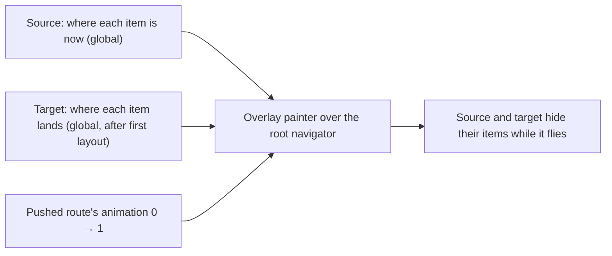

# Many-Object Flight Across Routes

> **Parent Skill:** [flutter-ui-animations](../SKILL.md)

A crowd of items leaves one screen and lands in another page's canvas: each item from where it is
drawn now to where it will be drawn, as one flight that a back gesture or a second tap reverses.

---

## 1. Why Not `Hero`

| | `Hero` | Overlay flight |
| :-- | :-- | :-- |
| Items | One widget per tag | Hundreds in one painter |
| Per frame | Rebuilds and lays out each flying widget | Writes a buffer, one repaint |
| Endpoints | Widget rects | Any point: a dot on a globe, a spot through a camera |
| Size change | Scales the widget | Items change level of detail (dot → sprite → live) |

Keep `Hero` for one card or avatar. Use the overlay when the items are drawn by a painter.

## 2. The Parts

1. **Source** answers `Map<String, ItemSpot> Function()` — each item's global centre and size now,
   read from its `RenderBox.localToGlobal` and its own transform (a camera, a turning globe).
   Items it cannot see (the far side of a globe) are absent and fade in at the target instead.
2. **Target** answers the same after its first layout (a post-frame callback), through its own
   camera. Read it every frame while flying: the target may still be settling.
3. **Progress is the pushed route's `animation`**, as `Hero` does: push runs it 0 → 1, pop runs it
   back, and a pop in mid-flight reverses from where the items are. Never start a second
   controller for the same flight.
4. **The overlay** is an `OverlayEntry` in the root overlay (above both routes), inserted when the
   push starts and removed when the animation completes or is dismissed.
5. **Hiding:** while the flight runs, the source and the target skip the flying items (or the
   whole layer); only the overlay draws them. Nothing is drawn twice, nothing blinks at the ends.

## 3. One Item's Path

- **Stagger:** item `i` moves over `[d_i, d_i + (1 - spread)]` of the progress, `d_i = hash01(id) ·
  spread`, so the crowd leaves as a crowd. At progress 0 and 1 every item is exactly at an end.
- **Arc:** a quadratic curve whose control point is the midpoint lifted by a share of the distance.
- **Size** interpolates between the two ends; the painter picks the level of detail from the size
  on screen, so a dot grows into a sprite and then a live drawing on the way.
- **Curve:** ease the route's value (`Curves.easeInOutCubic`) inside the painter, not by a second
  animation.

## 4. Reduced Motion and Failure

- `MediaQuery.disableAnimationsOf(context)`: no overlay; the route cross-fades and the target shows
  its items at once.
- A source or target that cannot answer (unmounted, zero size) ends the flight early: the target
  shows its items, the overlay is removed. A flight never blocks navigation.

## 5. Tests

| What | How |
| :-- | :-- |
| Ends are exact | Pump the push to its end: overlay gone, target items at their spots |
| No jump mid-way | Sample positions at several `pump(Duration)` steps; the largest step between samples stays small |
| Interruption reverses | Pop at half-way; positions continue from where they were, back to the source |
| Hidden twice never | While flying, the target reports its flying items hidden |
| Reduced motion | With `disableAnimations`, no overlay entry is inserted |
