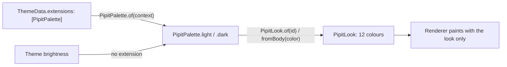

# Palette as a `ThemeExtension`

## 1. Overview & When to Apply

Use this skill whenever:
- Adding, renaming or removing a slot in `PipitPalette` (`lib/src/pipit_palette.dart`).
- Changing how `PipitLook` derives a bird's colours from a body colour (`lib/src/pipit_look.dart`).
- A user-facing question about restyling birds through `ThemeData.extensions`.

---

## 2. Prerequisites & Related Skills

| Relation | Skill | Purpose |
| :--- | :--- | :--- |
| **Parent Hub** | [flutter-ui-hub](../flutter-ui-hub/SKILL.md) | UI laws and routing. |
| **Painting** | [flutter-procedural-character](../flutter-procedural-character/SKILL.md) | The painter takes resolved colours; it never reads the theme. |
| **Goldens** | [flutter-golden-tests](../flutter-golden-tests/SKILL.md) | Every palette change is a golden in both palettes. |

---

## 3. Technical Constraints

1. **Two constants, nothing else.** `PipitPalette.light` and `PipitPalette.dark` are the only places in `lib/` with `Color(0x…)` literals (Law 3). A slot that exists in one must exist in the other.
2. **Shared versus per-bird.** The palette holds what every bird shares (belly, beak, iris, pupil, gold, metal, leather, the optional `ink` outline) plus `bodies`, the ready body colours. Per-bird colours (wing, mask, outline, band) are **derived** in `PipitLook.fromBody` with `Color.lerp`, so a user's own body colour can never clash. Add a derivation before adding a slot.
3. **Full `ThemeExtension` contract.** A new slot gets: a `required final` field in the primary constructor (or `final Color?` when optional like `ink`), a value in both constants, a parameter in `copyWith`, a `Color.lerp` line in `lerp`, and a line in the README's "Colours" section.
4. **Resolution has one door:** `PipitPalette.of(context)` returns the installed extension or falls back by `Theme.of(context).brightness`. The package never reads `ColorScheme`; a bird must look right in a non-Material tree and in a user's custom theme alike.
5. **Immutable and `const`.** `@immutable`, `const` constructor, so users can build looks in `const` trees and `copyWith` on a constant palette.
6. **Looks are values.** `PipitLook` implements `==`/`hashCode` over all twelve colours so `shouldRepaint` can compare looks by value.

---

## 4. Workflow: Adding a Palette Slot

1. Add the field to the `PipitPalette` primary constructor; give it a value in `light` and `dark` that reads well on both grounds.
2. Thread it through `copyWith` and `lerp`.
3. If a bird uses it, add the matching field to `PipitLook`, its primary constructor, `fromBody`, `==` and `hashCode`.
4. Use it in the renderer through the look only.
5. Extend `test/pipit_look_test.dart` (derivation) and the goldens; rerun `tool/screenshot_test.dart`.
6. Document it in the README "Colours" section and in `CHANGELOG.md`.

---

## 5. Anti-Patterns

| Anti-Pattern | Severity | Corrective Action |
| :--- | :--- | :--- |
| A colour literal in a painter or view file | **CRITICAL** | Move it to the palette or derive it in `PipitLook`. |
| Reading `colorScheme` inside the package | **CRITICAL** | `PipitPalette.of(context)` only. |
| A slot added to `light` but not `dark` (or not to `lerp`) | **HIGH** | Complete the contract in one commit; the analyzer does not catch a missing `lerp` line. |
| A per-bird colour as a palette slot | **MEDIUM** | Derive it from the body with `Color.lerp` so custom bodies stay harmonious. |

---

## 6. Verification Checklist

- [ ] Literals only in `PipitPalette.light` / `.dark`.
- [ ] New slot present in both constants, `copyWith`, `lerp`, README.
- [ ] `PipitLook` fields, `fromBody`, `==`, `hashCode` updated if the slot reaches a bird.
- [ ] Goldens in both palettes and `doc/pipit.png` redrawn.
- [ ] `CHANGELOG.md` entry if the public palette API changed.
