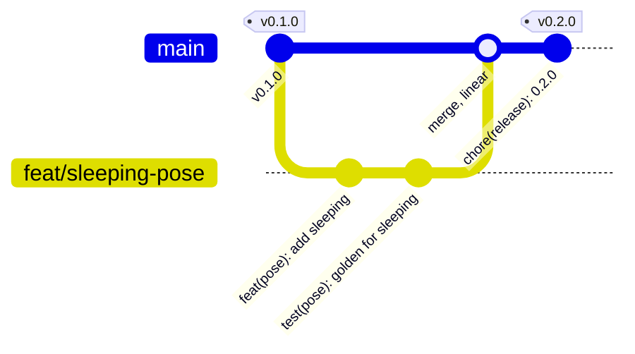

# Git Workflow Hub

## 1. Golden Repository Safety Rules

1. **Never push or publish without an explicit instruction** from the user (Law 6). Local `git add` / `git commit` are fine when asked.
2. **Pre-Push Quality Gate, every time, in order:**
   - `dart format --output=none --set-exit-if-changed .`
   - `dart analyze --fatal-infos`
   - `flutter test` in `packages/pipit` and in `packages/pipit_sounds`
   Any failure aborts the push until fixed and re-verified.
3. **Never force-push `main`.** `--force-with-lease` is allowed only on your own short-lived branch after a rebase.
4. **Never commit secrets or build output.** `pubspec.lock` is ignored on purpose (a library does not pin); `build/`, `.dart_tool/` and `CLAUDE.local.md` stay ignored.
5. **Linear history.** Rebase a branch onto `origin/main` before merging; no merge commits from `main` into a branch.
6. **A release is a tag plus a publish.** `<package>-vX.Y.Z` on `main` matches `pubspec.yaml` and the top of `CHANGELOG.md`.

---

## 2. Git Skill Mesh & Routing Matrix

| Task | Target Skill | Purpose |
| :--- | :--- | :--- |
| **Writing commits** | [git-commit-standards](../git-commit-standards/SKILL.md) | Conventional Commits, atomic changes, what goes in the body. |
| **Rebase & conflicts** | [git-rebase-conflict-resolution](../git-rebase-conflict-resolution/SKILL.md) | Interactive rebase, squashing, syncing with `origin/main`. |
| **Hygiene & recovery** | [git-hygiene-recovery](../git-hygiene-recovery/SKILL.md) | Stash, clean, reflog, cherry-pick, keeping secrets out. |
| **Quality gate detail** | [quality_and_git.md](../../rules/quality_and_git.md) | The rule file behind the gate and the release checklist. |

---

## 3. Branch Model (Trunk on `main`)



- **`main`:** always publishable. Every commit on it passes the gate.
- **`feat/<name>`, `fix/<name>`, `docs/<name>`, `chore/<name>`:** short-lived, branched from `main`, rebased onto `main`, merged fast-forward or squashed.
- No `develop`, no `release/*`, no `hotfix/*`: a fix is a `fix/` branch and a patch tag.

---

## 4. End-to-End Workflow

### Step 1: Start from the latest `main`
```bash
git checkout main && git pull origin main
git checkout -b feat/<short-name>
```

### Step 2: Implement, format, test
```bash
dart format .
dart analyze --fatal-infos
flutter test
```

### Step 3: Commit with Conventional Commits
```bash
git add packages/pipit/lib/src/pipit_pose.dart packages/pipit/test/pipit_pose_test.dart
git commit -m "feat(pose): add the sleeping pose"
```

### Step 4: Rebase onto `main` before merging
```bash
git fetch origin
git rebase origin/main
```

### Step 5: Gate, then push only on instruction
```bash
dart format --output=none --set-exit-if-changed . && dart analyze --fatal-infos && (cd packages/pipit && flutter test) && (cd packages/pipit_sounds && flutter test)
git push -u origin feat/<short-name>   # only after the user says push
```

### Step 6: Release (only on instruction)
1. Bump `version:` in `pubspec.yaml`; add the entry at the top of `CHANGELOG.md`; update the `^` constraint in the README install snippet.
2. If anything visible changed: `flutter test tool/screenshot_test.dart --update-goldens` and look at `doc/pipit.png`.
3. `dart pub publish --dry-run` must be clean.
4. `git commit -m "chore(release): X.Y.Z"`, `git tag <package>-vX.Y.Z`, then push with tags and `dart pub publish` when told to.

---

## 5. Verification Checklist

- [ ] Branch created from the latest `origin/main` and rebased onto it before merging.
- [ ] Commit messages follow [git-commit-standards](../git-commit-standards/SKILL.md); no "wip" commits left.
- [ ] Gate passed: format, analyze, test.
- [ ] `pubspec.yaml` version, `CHANGELOG.md`, README constraint and tag agree before a release.
- [ ] No push or publish happened without the user's explicit instruction.
