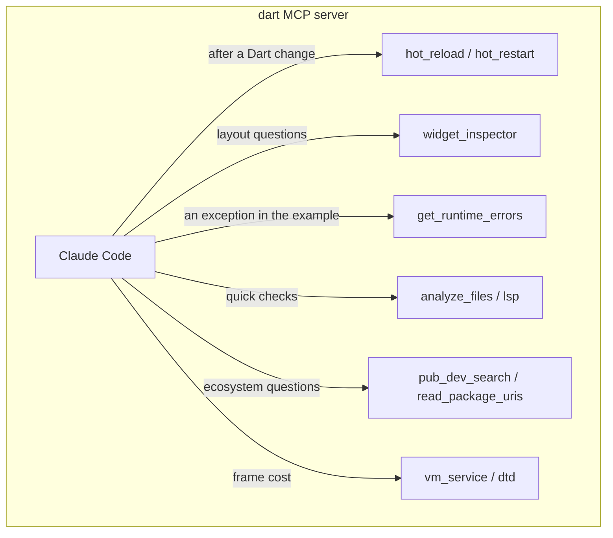

# MCP Tooling Hub

## 1. Overview

Pipit has no `.mcp.json`. The only server in use is **`dart`** (`dart mcp-server`), registered in the developer's user scope (`~/.claude.json`, `claude mcp add --scope user`). A fresh clone therefore has no project servers to approve; if `mcp__dart__*` tools are missing, the server is not registered on this machine and the CLI commands below are the fallback.

Registration is not availability: a tool that needs a running app (`hot_reload`, `widget_inspector`, `get_runtime_errors`) only works while the example is running, and the example is the only thing that runs (`cd example && flutter run -d chrome`).

---

## 2. Tool Catalog

| Tool | Purpose | Use in this package |
| :--- | :--- | :--- |
| `hot_reload` | Sub-second reload of the running app. | After every painter, geometry or widget edit while the example runs. |
| `hot_restart` | Restart app state without rebuilding the binary. | After changing `PipitStage`, top-level constants or the example's `main`. |
| `widget_inspector` | Widget tree, render objects, constraints. | Unbounded-height or overflow questions in the example or a user's tree. |
| `get_runtime_errors` | Active exceptions and stack traces. | When the example throws; see [dart-fix-runtime-errors](../dart-fix-runtime-errors/SKILL.md). |
| `analyze_files` / `lsp` | In-memory analysis, symbol navigation. | Checking a file before the full `dart analyze --fatal-infos`. |
| `pub_dev_search` | pub.dev metadata and scores. | Answering ecosystem questions only. Never to add a dependency (Law 1). |
| `read_package_uris` / `rip_grep_packages` | Read and grep the Flutter SDK and cached packages. | Looking up `CustomPainter`, `Ticker`, `ThemeExtension` or `matchesGoldenFile` internals. |
| `vm_service` / `dtd` | VM RPC, frame timings, allocation profiles. | Measuring a crowd of birds; see [performance-hub](../performance-hub/SKILL.md). |
| `flutter_driver_command` | Driver commands for integration tests. | Not used: the package has no driver entrypoint. |

---

## 3. Decision Matrix: MCP vs Terminal

| Need | Prefer | Why |
| :--- | :--- | :--- |
| See a painter change | `hot_reload` | Instant; no rebuild. |
| Full quality gate | Terminal: `dart format`, `dart analyze --fatal-infos`, `flutter test` | The gate must run the same commands CI and the user run. |
| Goldens / README picture | Terminal: `flutter test ... --update-goldens` | Writes files; needs the test runner. |
| A stack trace from the example | `get_runtime_errors` | Structured, no log scraping. |
| How does `Ticker` behave under `TickerMode`? | `read_package_uris` on `package:flutter/scheduler.dart` | Reads the real source instead of guessing. |
| Is there a package for X? | Answer from `pub_dev_search`, then say the package stays dependency-free | Law 1. |

---

## 4. Related Skills

| Skill | Purpose |
| :--- | :--- |
| [dart-fix-runtime-errors](../dart-fix-runtime-errors/SKILL.md) | Runtime error resolution via `get_runtime_errors` and `hot_reload`. |
| [flutter-fix-layout-issues](../flutter-fix-layout-issues/SKILL.md) | Layout constraint debugging via `widget_inspector`. |
| [dart-run-static-analysis](../dart-run-static-analysis/SKILL.md) | `analyze_files` for quick checks, `dart analyze` for the gate. |
| [performance-hub](../performance-hub/SKILL.md) | Frame timings with `vm_service`. |
