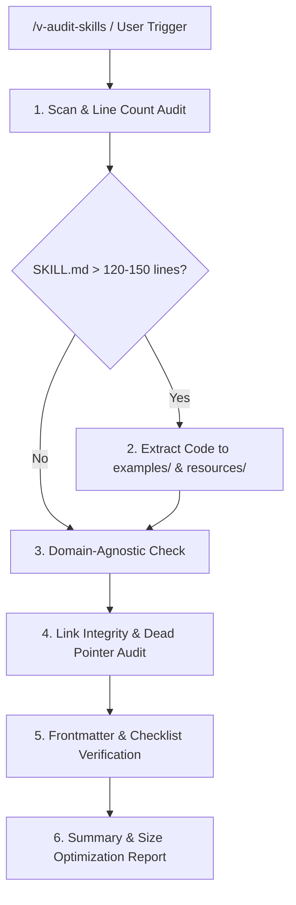

# Skill Auditor & Refactoring Standardizer

## 1. Overview & Audit Lifecycle

The **Skill Auditor** performs comprehensive quality audits, file size optimizations, progressive disclosure extractions, and link integrity validations across `.claude/skills/`.

---

## 2. Prerequisites & Related Skills

| Relation | Skill | When to Consult |
| :--- | :--- | :--- |
| **Parent & Standards** | [skill-creator](../skill-creator/SKILL.md) | For foundational skill authoring rules and templates |
| **Workflow Slash Command** | `/v-audit-skills` | To invoke this audit workflow directly from chat |

---

## 3. The 5-Step Audit & Refactoring Protocol

When invoked, execute the following 5-step sequence systematically:

### Step 1: Line Count & Progressive Disclosure Audit
- Run `wc -l` across all target `SKILL.md` files.
- If any `SKILL.md` exceeds **120–150 lines**:
  - Identify full code classes or multi-file templates (>30 lines) $\rightarrow$ Move to `references/<guide_name>.md` with fenced code blocks (avoids Dart toolchain / import_sorter pollution).
  - Identify JSON schemas, API payloads, or config dictionaries $\rightarrow$ Move to `resources/<schema>.<ext>`.
  - Identify long reference specifications $\rightarrow$ Move to `references/<doc>.md`.
  - Replace extracted content in `SKILL.md` with concise summaries and relative links: `[Guide Name](references/guide_name.md)`.

### Step 2: Domain-Agnostic & Abstract Naming Audit
- Audit all code snippets, persona templates, and mock data for domain residue.
- Replace project-specific identifiers with universal placeholders (`[Feature]`, `Item`, `User`, `Account`, `Product`, `Resource`).

### Step 3: Link Integrity & Zero Dead Pointers Audit
- Verify every relative markdown link in `SKILL.md` resolves to an active, existing file.
- Fix broken paths, outdated filenames, or stale pointers in the same turn.

### Step 4: Template & Quality Standard Verification
Verify each skill contains all mandatory sections:
1. Valid YAML frontmatter (`name` in kebab-case, `description` with explicit triggers).
2. Clear architectural overview with Mermaid diagrams.
3. Anti-patterns table with Severity matrix (`CRITICAL`, `HIGH`, `MEDIUM`).
4. Task-oriented Agent Verification Checklist (`- [ ] ...`).

### Step 5: Generate Audit Report
Summarize changes made, before/after line counts, extracted example files, and verified links.

---

## 4. Anti-Patterns & Severity Matrix

| Anti-Pattern | Severity | Why It Fails | Corrective Action |
| :--- | :--- | :--- | :--- |
| **Monolithic `SKILL.md` (>200 lines)** | **HIGH** | Overloads agent context window upon activation, reducing reasoning precision. | Apply progressive disclosure; move code guides to `references/` and schemas to `resources/`. |
| **Stale / Broken Relative Links** | **CRITICAL** | Agents fail when attempting to read non-existent reference files. | Verify and update all relative paths during the audit turn. |
| **Project-Specific Domain Residue in Skills** | **MEDIUM** | Destroys skill reusability across different codebases. | Replace with abstract placeholders (`[Feature]`, `Item`, `User`). |

---

## 5. Agent Verification Checklist

When completing a skill audit:
- [ ] All target `SKILL.md` files streamlined to ≤ 120–150 lines.
- [ ] Each `description` is ≈150–200 chars, leads with scope, and ends with "Use when ..." triggers.
- [ ] Total description budget across all skills is under ~25,000 chars, so none are dropped from the session listing.
- [ ] Code samples >30 lines moved to `references/` (as `.md` guides with fenced code) or `resources/`.
- [ ] All relative markdown links verified and working.
- [ ] All examples use domain-agnostic identifiers.
- [ ] Project-wide rules/invariants reside in `.claude/rules/<domain>.md` rather than bloating `.claude/CLAUDE.md`.
- [ ] Root `CLAUDE.md` remains lean (<200 lines) with synchronized rule catalog links.
- [ ] Audit report presented with before/after line counts.
