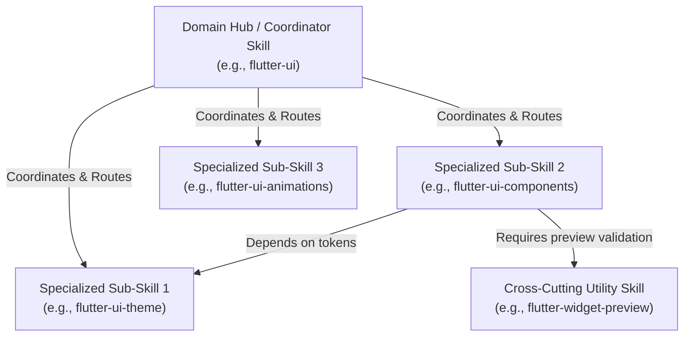

# Skill Architecture, Hierarchy & Directory Organization

> **Parent Skill:** [skill-creator](../SKILL.md)

---

## 1. Skill Architecture: Standalone vs Skill Trees & Meshes

When a domain covers multiple distinct responsibilities, structure skills as a **Hierarchical Tree or Interlinked Mesh**:



### 1.1 Skill Hierarchy Roles

1. **Root / Hub Skill (Coordinator):**
   - Serves as the primary entry point and high-level architectural overview for a domain (e.g., `flutter-ui`, `network-layer`).
   - Outlines domain philosophy, general constraints, and a **Routing Decision Table** pointing to specialized sub-skills.
   - Does NOT contain exhaustive implementation code for every sub-topic.

2. **Specialized Sub-Skill (Child / Leaf):**
   - Deep-dives into a specific sub-domain (e.g., `flutter-ui-theme`, `flutter-ui-responsive`, `flutter-reactive-forms`).
   - Contains concrete code snippets, anti-patterns, and step-by-step implementation recipes.
   - Explicitly references parent or sibling skills for prerequisites.

3. **Cross-Cutting / Utility Skill:**
   - Provides shared workflows or tools utilized across multiple domains (e.g., `flutter-widget-preview`, `dart-run-static-analysis`, `flutter-testing`).

---

## 2. Directory & Folder Organization

### 2.1 Standalone Skill Structure

For single-purpose, self-contained skills:

```text
.claude/skills/<skill-name>/
├── SKILL.md            # REQUIRED: Main instruction file with YAML frontmatter
├── scripts/            # OPTIONAL: Executable helper scripts and CLI utilities
├── examples/           # OPTIONAL: Reference implementations and boilerplate code
├── resources/          # OPTIONAL: Configuration templates, JSON schemas, assets
└── references/         # OPTIONAL: Extended manuals and detailed docs (progressive disclosure)
```

### 2.2 Domain-Grouped Skill Set (Flat Layout)

Claude Code discovers skills **only** at `.claude/skills/<skill-name>/SKILL.md`; nested category folders are not scanned. Group related skills with a shared name prefix and a `metadata.category` frontmatter field:

```text
.claude/skills/
├── <domain>-hub/                       # Hub / Coordinator skill
│   ├── SKILL.md                        # Entry point, routing table, general domain rules
│   └── references/                     # Architecture diagrams and domain specifications
├── <domain>-<sub-feature-a>/           # Specialized sub-skill A
│   ├── SKILL.md                        # Focused recipes, rules, and code snippets
│   └── examples/                       # Concrete implementation examples
└── <domain>-<sub-feature-b>/           # Specialized sub-skill B
    └── SKILL.md
```

Each `SKILL.md` in the set declares its group in frontmatter:

```yaml
metadata:
  category: <domain>
```

*Example: UI domain set:* `flutter-ui-hub`, `flutter-ui-material`, `flutter-ui-animations`, `flutter-ui-responsive-adaptive` (all siblings under `.claude/skills/`).

---

## 3. Subfolder Usage Matrix (`references/`, `resources/`, `scripts/`)

| Subfolder | Primary Purpose | When to Use | When NOT to Use (Keep in `SKILL.md`) |
| :--- | :--- | :--- | :--- |
| **`references/`** | Extended domain specs, deep-dive manuals, and **annotated code guides** (`<name>_guide.md`). | • Decomposed skill modules under Progressive Disclosure.<br/>• Full architectural code guides with fenced code blocks (e.g. ````dart ````).<br/>• **Standard for code samples:** keeps Dart tooling (`dart analyze`, `import_sorter`) clean of mock/orphan files. | • Core architectural rules and primary routing tables needed during standard activation. |
| **`resources/`** | Assets, schemas, and template files. | • Static mock JSON payloads, project config templates (`launch.json`, `.gitignore`), or boilerplate schemas. | • Small config blocks easily displayed as inline markdown snippets. |
| **`scripts/`** | Executable automation scripts and command helpers. | • Multi-step bash/python automation or code generation validation scripts. | • Single-line CLI commands (embed directly in `SKILL.md`). |
