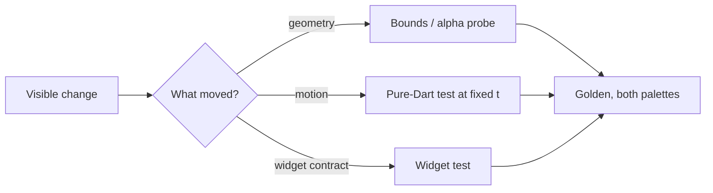

# Testing Strategy Hub

## 1. Overview & What Gets Tested

Pipit has no business logic to mock: its tests prove **geometry, motion and the widget contract** with `flutter_test` alone (Law 1: no mocking or golden packages).

| Layer | What it proves | Where |
| :--- | :--- | :--- |
| **Pure Dart** | Idle rhythm per id, blink schedules, spring convergence, look derivation. Fixed inputs, exact or tolerance assertions. | `test/pipit_life_test.dart`, `test/pipit_pose_test.dart`, `test/pipit_look_test.dart` |
| **Pixel probes** | Every facing and accessory stays inside `PipitRenderer.bounds`; a region that must be painted has alpha. | `test/pipit_test.dart` (renders to an image, reads RGBA) |
| **Widget** | `PipitView` semantics, tap and hover reactions, `TickerMode` and reduced motion, `seconds: null` is still. | `test/pipit_test.dart` |
| **Golden** | The whole picture at a fixed `seconds`, both palettes. | `test/goldens/` (none committed yet) and `tool/screenshot_test.dart` (the README picture) |



---

## 2. Testing Skill Tree & Routing Matrix

| Task | Target Skill | Purpose |
| :--- | :--- | :--- |
| **Widget tests** | [testing-widget](../testing-widget/SKILL.md) | Pumping an animated widget at a fixed time, finding by semantics, reactions. |
| **Goldens** | [flutter-golden-tests](../flutter-golden-tests/SKILL.md) | `matchesGoldenFile` at a fixed state, both palettes, updating deliberately. |
| **Painting under test** | [flutter-procedural-character](../flutter-procedural-character/SKILL.md) | Why painters take time as an argument, and how to render one to pixels. |
| **Frame cost** | [performance-hub](../performance-hub/SKILL.md) | Measuring a crowd in profile mode, not in a test. |

---

## 3. Core Laws of Testing

1. **Fixed inputs only.** A test passes a constant `id`, a constant `seconds` (or a `ValueNotifier` it advances itself) and a named palette. No `DateTime.now()`, no `Random()` without a seed, no `pumpAndSettle()` on a running stage (it never settles).
2. **Test through the public API where possible**; import `package:pipit/src/...` only for probes that need the renderer or the idle model directly.
3. **A visible change gets a test** before the golden: a bound, an alpha probe, or a motion assertion. Goldens catch the rest.
4. **Dispose what you create:** `addTearDown(notifier.dispose)`, `addTearDown(tester.view.reset)`.
5. **The README picture is a golden too.** `tool/screenshot_test.dart` is outside `test/` so `flutter test` does not run it; run it by path with `--update-goldens` and look at `doc/pipit.png` before committing.

---

## 4. Test Directory Standard

```text
test/
├── pipit_test.dart          # Widget contract and pixel probes
├── pipit_life_test.dart     # Idle, blink, breath per id
├── pipit_pose_test.dart     # Poses and the spring transition
├── pipit_look_test.dart     # Look derivation from body and palette
└── goldens/                 # Committed PNGs when added, named <subject>_<variant>.png
tool/screenshot_test.dart    # doc/pipit.png, run on purpose
```

One file per concern; a new pose, accessory or reaction extends the matching file rather than adding `pipit_test2.dart`.

---

## 5. Anti-Patterns (Strictly Prohibited)

| Anti-Pattern | Severity | Corrective Action |
| :--- | :--- | :--- |
| `pumpAndSettle()` with a live `PipitStage` | **CRITICAL** | Drive a `ValueNotifier<double>` yourself or pump fixed durations. |
| A golden at "now" or with a random id | **CRITICAL** | Constant id, constant seconds, named palette. |
| Adding `mocktail`, `golden_toolkit` or `alchemist` | **CRITICAL** | Law 1: `flutter_test` is enough; write a fake by hand. |
| Updating goldens to make a red run green | **HIGH** | Read the diff in `test/failures/` first; update only intended changes. |
| Asserting exact floats of a spring | **MEDIUM** | Use `closeTo` / `moreOrLessEquals` with a stated tolerance. |

---

## 6. Master Verification Checklist

- [ ] `flutter test` passes; `tool/screenshot_test.dart` was rerun if the picture changed.
- [ ] Every test uses fixed ids, seconds and palettes.
- [ ] A new visible feature has a probe or motion test and a golden in both palettes.
- [ ] Notifiers and the test view are disposed / reset in `addTearDown`.
- [ ] No new dev dependency appeared in `pubspec.yaml`.
