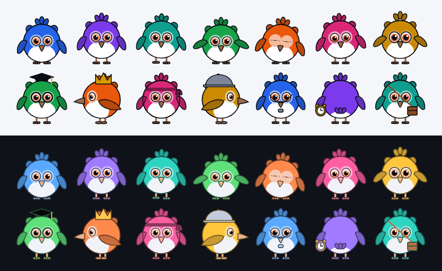

# pipit

A hand-drawn bird for Flutter, and its voice. Two packages, published
separately from this repository:

| Package | What it is |
| :--- | :--- |
| [`packages/pipit`](packages/pipit) ([pub.dev](https://pub.dev/packages/pipit)) | The bird: `PipitView`, `PipitStage`, poses, accessories, expressions, palette. Drawn on a canvas, no assets, no dependencies. |
| [`packages/pipit_sounds`](packages/pipit_sounds) ([pub.dev](https://pub.dev/packages/pipit_sounds)) | A chirp for every pose and reaction, synthesised to the bird's motion, with a small player on `audioplayers`. |



```yaml
dependencies:
  pipit: ^0.2.0
  pipit_sounds: ^0.1.0 # optional
```

Each package has its own README, CHANGELOG and `example/`.

## License

MIT, see [packages/pipit/LICENSE](packages/pipit/LICENSE).
